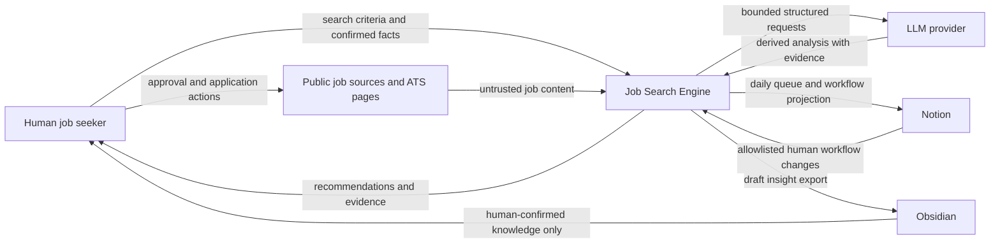
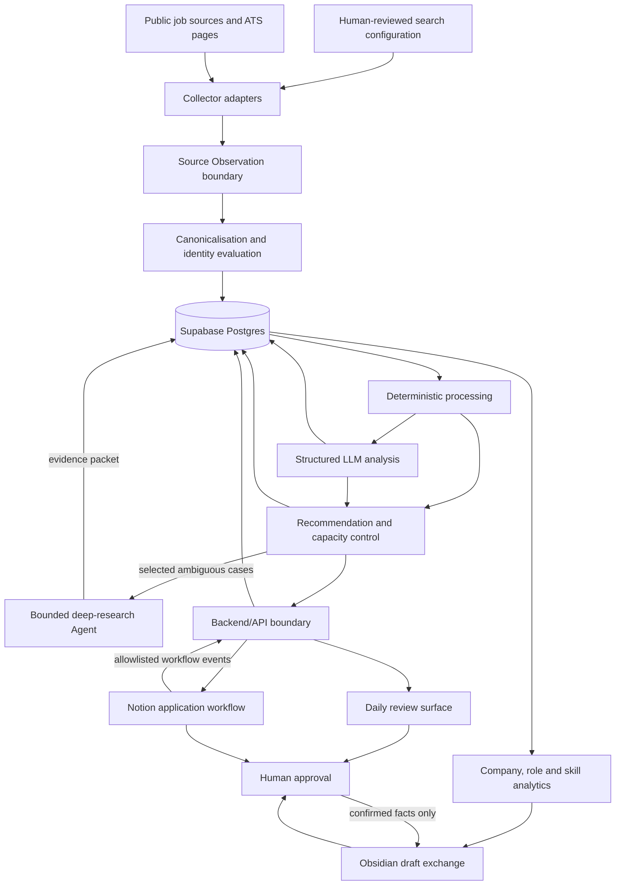

Document status: ACCEPTED
Accepted by: Human project owner
Accepted on: 2026-09-29

# Job Search OS Architecture

Classification: **CURRENT / TARGET / TRANSITION**, separated below.

Last reviewed: 2026-09-29 against the local working tree. Remote deployment,
GitHub repository settings, live collector health, Supabase, Notion, and Obsidian
connectivity were not verified by this review.

This document is the authoritative high-level architecture entry point for the
Job Search OS. It defines system boundaries, component responsibilities, data
authority, trust boundaries, and the evolution path from the current implementation
to the target architecture. It is not a database field catalog, complete product
specification, detailed technical design, execution plan, or progress log.

Detailed responsibilities belong to the following documents:

- [Agent operating contract](AGENTS.md): repository-wide agent rules and approval
  boundaries.
- [Roadmap](docs/ROADMAP.md): phase sequence and desired outcomes.
- [Current engineering handoff](docs/CURRENT_STATE.md): current work state and next
  handoff.
- [Documentation catalog](docs/README.md): navigation and document-family authority.
- [Canonical Job model](docs/design-docs/canonical-job-model.md): detailed Canonical
  Job, Source Observation, identity, and provenance design.
- [Active ExecPlans](docs/exec-plans/active/): implementation, validation, and
  progress for authorized work.

---

## 1. Purpose and scope

The Job Search OS is a personal-first job-search decision system. It turns
multi-source job discovery into a small, explainable daily action queue, supports
human-managed application progress in Notion, and uses job and application evidence
to produce company, role, and skill insights.

The system may:

- Collect jobs from multiple public sources using human-confirmed search criteria.
- Preserve source observations, normalize job facts, and identify equivalent jobs
  conservatively.
- Apply deterministic hard requirements before LLM-based structured extraction and
  fit analysis.
- Perform bounded, traceable Agent research for a small number of high-value or
  incomplete jobs.
- Produce a capacity-controlled daily queue. The currently accepted product target
  is at most three `Act now` items and five `Review` items.
- Project human decisions, application stages, next actions, and outcomes into a
  Notion workflow.
- Aggregate company size, business themes, role requirements, and skill frequency.
- Produce candidate insights, story suggestions, or learning suggestions for
  Obsidian, while allowing only human-confirmed personal facts into the formal
  knowledge base.

The system does not:

- Submit applications or send external messages without explicit human approval.
- Infer and confirm nationality, visa status, work authorization, education,
  experience, outcomes, metrics, or personal reflections.
- Treat LLM or Agent output directly as a job fact or personal fact.
- Bypass platform access controls, anti-automation measures, authentication, or
  terms of use.
- Change an authoritative data source without migration, validation, recovery, and
  approval.

---

## 2. Architecture principles and invariants

The following principles apply across all phases. Changing any of them is an
architectural decision and requires a design or ADR accepted by the human owner.

1. **Human steers; bounded automation executes.** The human owns goals, fact
   confirmation, risk boundaries, and final actions. Software, LLMs, and Agents
   execute only within explicit boundaries.
2. **Deterministic before probabilistic.** Conditions decidable by explicit rules
   must be handled by deterministic software before LLM judgement.
3. **Unknown remains unknown.** Missing evidence remains `UNKNOWN`; it must not
   silently become `false`, `INELIGIBLE`, `CLOSED`, or score zero.
4. **Separate facts, assessments, and workflow state.** Job facts, candidate
   assessments, and human application state are stored and evolved separately.
5. **Separate Eligibility, Fit, and Priority.**
   - `Eligibility`: whether hard requirements are satisfied.
   - `Fit Score`: the relatively stable match between the candidate and the role.
   - `Daily Priority`: whether the role deserves limited action capacity today.
6. **One owner per synchronized field.** Each synchronized field has exactly one
   authoritative owner. Supabase, Notion, Obsidian, and JSON must not form an
   uncontrolled multi-master system.
7. **Provenance before conclusion.** Sources, original text, observation time, and
   analysis version must be sufficient to explain important conclusions.
8. **Conservative identity.** A URL is not Canonical Job identity. Fuzzy similarity
   may create a review candidate but must not automatically merge facts.
9. **Job live state differs from application state.** `LIVE / CLOSED / UNKNOWN`
   and `saved / reviewing / applied / interviewing / rejected / offer / withdrawn`
   are separate state machines.
10. **LLM output is derived and versioned.** Model, prompt/schema version, input
    summary, evidence, and time are traceable. LLM output does not overwrite
    canonical facts.
11. **Evolution over big-bang rewrite.** Preserve working paths, establish
    compatibility boundaries, and replace them incrementally. Do not perform an
    unverified rewrite for structural cleanliness.
12. **Human approval for external effects.** Application submission, sensitive
    answers, first production writes, authority cutover, material deletion, and
    high-risk deployment require human approval.

### 2.1 Eligibility invariants

Currently confirmed hard-requirement semantics include:

- The target is full-time work. A role explicitly identified as non-full-time may
  be deterministically classified as ineligible.
- A role explicitly restricted to British citizens may be deterministically
  classified as ineligible.
- British-citizens-only restrictions, current right to work, future sponsorship,
  and security-clearance requirements are distinct and must not substitute for one
  another.
- When work-authorization or sponsorship evidence is insufficient, the result
  remains `UNKNOWN` rather than becoming an automatic rejection.
- A hard-requirement conclusion records the triggering rule and locatable evidence.

More complete user behaviour, exceptions, and acceptance examples belong in a
future product specification; this file does not expand into a rule manual.

---

## 3. System context



### 3.1 Responsibility boundary

| Actor / system | Owns | Must not silently own |
|---|---|---|
| Human | Search intent, target roles, personal facts, application decisions, sensitive answers, final submissions, confirmation of career evidence | Raw collection mechanics, deterministic transformations, routine synchronization |
| Deterministic Software | Collection, parsing, validation, normalization, canonicalization boundaries, hard rules, persistence, synchronization mechanics, audit and reproducible ranking inputs | Ambiguous semantic claims presented as facts |
| LLM | Constrained structured extraction, summarization, skill/role interpretation, evidence-linked fit analysis | Canonical job facts, eligibility without evidence, human facts, external action approval |
| Bounded Agent | Multi-step research for selected ambiguous/high-value cases, tool orchestration, evidence packets | Unbounded autonomous browsing, application submission, changing system authority, unsupported conclusions |
| Supabase Postgres | TARGET authority for engine-owned operational data | Human-authored Notion workflow or confirmed Obsidian knowledge |
| Notion | TARGET primary human workspace for application workflow and next actions | Raw scraped jobs or canonical source facts |
| Obsidian | Human-confirmed career evidence, stories, reflections and learning plans | Unreviewed model inference presented as confirmed personal truth |

---

<a id="current--implemented"></a>

## 4. CURRENT — Implemented

The following is implemented in the local working tree as reviewed on 2026-09-29.
It does not establish remote workflow health or live source availability.

### 4.1 Current logical flow

```text
config.example.json + optional config.json
                    ↓
          scrape_jobs.py collectors
                    ↓
 source filtering / normalization / deduplication
                    ↓
             save_jobs_output
        ┌───────────┼───────────────────────┐
        ↓           ↓                       ↓
source snapshots   output/all_jobs.json    Markdown/HTML digests
        │           │                       │
        └──────┬────┘                       └─ notifications
               ↓
       static triage.html dashboard
               ├─ browser localStorage decisions and notes
               └─ optional output/scores.json

output/all_jobs.json ──→ weekly digest
output/all_jobs.json ──→ optional legacy triage_agent.py
                              ↓
                       output/scores.json
```

These branches are separate operations, not one transaction.
`output/all_jobs.json` is merged from the current result list; it is not rebuilt
by reading saved source snapshots.

### 4.2 Current components and responsibilities

| Component | Current responsibility | Current boundary / limitation |
|---|---|---|
| `config.example.json` and `config.json` | Search keywords, exclusions, sources, and notification-related configuration; the scraper deep-merges them at import time | The dashboard and notifier have separate loaders; there is no shared configuration service |
| `scrape_jobs.py` collectors | Source dispatch, requests/parsing, source-specific filtering, and partial normalization | Collectors return mutable dictionaries; there is no shared executable Canonical Job boundary |
| `scrape_jobs.py` processing | Source filtering, work-arrangement heuristics, URL/content deduplication, persistence, and digests | Collection, processing, and persistence remain concentrated in one large module |
| `save_jobs_output` | Writes source JSON and Markdown/HTML, merges the master, and triggers instant notifications | The writes and notifications are not atomic |
| `_merge_into_all_jobs` | Maintains cumulative `output/all_jobs.json` and applies 30-day retention using `first_seen` | CURRENT operational persistence; not the accepted target model's canonical identity store |
| `save_results` | Writes the legacy three-key `jobs.json` envelope | Does not perform master merge or instant notification; an existing compatibility exception |
| `triage.html` | Reads fixed source files, the master, and optional scores, then derives browser views | Decisions, notes, stars, and timeline data remain in URL-keyed localStorage and do not synchronize across devices |
| `notify.py` | Deterministic relevance, instant-notification tracking, and weekly digest | Notification identity is not the same contract as scraper/dashboard identity; delivery requires external credentials |
| `triage_agent.py` | Reads jobs from the master or source snapshots and writes URL-keyed `scores.json` | Legacy optional path; analysis is URL-bound and is not the target analysis store |
| GitHub Actions | Scheduled/manual collectors, tests, backfills, notifications, and optional output commits | Live health, repository variables/secrets, and deployment state were not established by local inspection |

### 4.3 Current data authority

CURRENT is not an idealized single database. It is a compatibility system in
which several files and browser-local state work together.

| Data category | CURRENT authority / location | Notes |
|---|---|---|
| Search configuration | Loaded `config.json` over `config.example.json` | The human owns intent; actual execution depends on the loaded configuration |
| Source result snapshots | `output/*_jobs.json` and other source-specific JSON | Overwritten source outputs; some failure paths may reuse an older snapshot |
| Cumulative operational job set | `output/all_jobs.json` | CURRENT primary job persistence path with 30-day retention |
| Legacy derived model scores | `output/scores.json` | Optional, URL-keyed, not canonical fact |
| Dashboard decisions and notes | Browser `localStorage` | Local-only and URL-keyed; no repository or cross-device synchronization |
| Notification history | Notification tracker files used by `notify.py` | Uses consumer-specific identity |
| Application workflow | No integrated authoritative store | Notion integration is not implemented |
| Career knowledge | External human-managed Obsidian material | No repository-controlled sync is implemented |

### 4.4 Current compatibility surfaces

Until replacements are implemented and validated, changes must preserve or explicitly migrate:

- `output/all_jobs.json` filename and envelope.
- Source JSON filenames and envelopes consumed by `triage.html` and workflows.
- CLI flags, workflow commands and expected output paths.
- Raw `url`, `direct_url`, `duplicate_urls`, legacy mixed-use `ats`, and 30-day retention behaviour.
- URL-keyed dashboard state and legacy `scores.json` lookup.
- Notification identity and tracker behaviour.
- `config.example.json` / `config.json` merge semantics.

Compatibility requirements are not declarations that these formats are permanent target domain models.

### 4.5 Current known structural risks

- Source/master JSON and the single-record JSON schema do not fully agree about `first_seen` and nullable `is_remote`.
- Scraper, dashboard, notifications and model scoring use different identity semantics.
- User workflow state is trapped in one browser's localStorage and keyed by raw URL.
- Collection, transformation, persistence, digest generation and notifications are tightly coupled.
- There is no database transaction, cross-output reconciliation or durable sync audit.
- The existing legacy AI path does not establish the target `Eligibility / Fit / Priority` separation.
- Passing local tests does not prove live collection, browser, notification, model or remote workflow health.

Detailed point-in-time evidence belongs in the [repository audit](docs/references/current-repository-audit.md), not in this architecture map.

---

## 5. TARGET — Accepted direction, not implemented state

TARGET describes accepted architectural direction. It does not claim that Supabase, Notion synchronization, the recommendation pipeline, Agent research, or Obsidian exchange currently exists.

### 5.1 Target logical architecture



These are logical responsibility boundaries, not commitments to a number of
microservices, a cloud topology, a frontend framework, or a model provider. Early
implementations may preserve the boundaries inside one process.

### 5.2 Target components

| Logical component | Responsibility | Explicit non-responsibility |
|---|---|---|
| Search Configuration | Stores human-confirmed target roles, locations, full-time requirement, exclusions, sources, and budgets | Does not store secrets; an Agent does not silently change career direction |
| Collector Adapters | Acquire public-source records and preserve source identity, URLs, raw/normalized evidence, and observation metadata | Do not decide candidate fit or write directly to Notion |
| Source Observation | Represents one provenance-bearing source observation | Is not a Canonical Job and does not automatically override facts from other sources |
| Canonicalisation | Normalizes facts, evaluates identity evidence, and produces conservative outcomes such as `AUTO_MERGE / POSSIBLE_MATCH / KEEP_SEPARATE` | Does not merge directly on fuzzy similarity or include candidate state in job identity |
| Supabase Repository | Persists engine-owned records, versions, sync metadata, and audit records | Does not become the authority for unreviewed personal stories |
| Deterministic Processing | Applies hard requirements, field validation, rule-based classification, live-state evidence, and reproducible features | Does not infer missing human facts or treat unknown as failure |
| Structured LLM Analysis | Performs structured JD extraction, role/skill interpretation, and evidence-linked Fit analysis | Does not overwrite canonical facts or approve an external action |
| Bounded Research Agent | Performs limited research for a small number of incomplete or high-value shortlisted roles | Does not research the full corpus without bounds, use unauthorized authenticated sessions, or submit applications |
| Recommendation Engine | Produces Daily Priority using Eligibility, Fit, urgency, freshness, and human capacity | Does not collapse Fit and Priority into an unexplainable single score |
| Backend/API | Isolates credentials, enforces authorization, and provides stable read/write and synchronization boundaries | Browser code does not hold service-role credentials or bypass policies |
| Daily Review Surface | Shows `Act now / Review`, explanations, evidence, and human action entry points | Does not apply automatically on behalf of the human |
| Notion Sync Adapter | Projects selected jobs and allowlisted workflow fields and receives traceable human-state changes | Does not turn Notion into the raw-job store or perform rule-free bidirectional overwrites |
| Analytics | Separates the market sample from the applied sample and aggregates company/business/skill/outcome trends | Does not present a small sample as the whole market or create unconfirmed personal facts |
| Obsidian Exchange | Produces explicit Markdown draft/import bundles and receives human-confirmed knowledge boundaries | Does not silently edit formal stories or label model-generated content as user experience |

### 5.3 Target processing flow

#### A. Discovery and factual persistence

1. The human confirms search configuration.
2. A Collector acquires source records and treats page content as untrusted data.
3. An Adapter creates a Source Observation and preserves provenance.
4. Canonicalisation evaluates source/ATS identity and conflicts.
5. Supabase stores the observation, canonical job, identity outcome, and audit
   metadata.

#### B. Eligibility, Fit and Priority

1. Deterministic Processing checks full-time status, explicit citizenship
   restrictions, and other mechanically decidable conditions first.
2. Eligibility remains `UNKNOWN` when evidence is insufficient.
3. The LLM produces structured, evidence-bearing derived analysis only for jobs
   permitted to enter semantic analysis.
4. Fit Score represents relative fit. Daily Priority separately considers
   timeliness, deadlines, evidence confidence, action cost, and daily capacity.
5. The Recommendation Engine produces a capacity-controlled queue. The current
   product target is `Act now <= 3` and `Review <= 5`.
6. Every conclusion in the queue is traceable to rules and evidence.

#### C. Human application workflow

1. Jobs that the human saves, reviews, or applies to are projected into Notion.
2. Notion is the primary workspace for application stage, next action, deadline,
   outcome, and human notes.
3. Only predefined workflow fields may write back to the engine.
4. The sync adapter stores external IDs, versions/updated times, last successful
   sync, conflicts, and retry audit.
5. Conflicts follow the field owner; there is no implicit last-writer-wins rule
   across all fields.
6. The human still performs every application submission on the external platform
   or explicitly approves it case by case.

#### D. Learning feedback loop

1. Analytics separately measures the discovered-but-not-applied market sample, the
   applied sample, and the interview/outcome sample.
2. Company size, business themes, skill demand, and outcome relationships retain
   their sample scope and time window.
3. The system may propose skill gaps, evidence gaps, story candidates, and learning
   suggestions.
4. Obsidian receives only exchange content explicitly marked as draft.
5. Personal facts, stories, reflections, and learning plans become formal Obsidian
   knowledge only after human confirmation.

### 5.4 Target data authority

| Data category | Authoritative owner | Other-system treatment |
|---|---|---|
| Human search intent and target-role decisions | Human, represented in reviewable configuration | Engine consumes; Agent may propose but not silently modify |
| Raw/source observation and provenance | Supabase Postgres | JSON is generated compatibility/export after cutover |
| Canonical job facts and identity outcomes | Supabase Postgres | Notion receives a selected projection, not ownership |
| Eligibility evidence and result | Supabase Postgres as versioned derived decision | Notion/UI may display; human override must be explicit and audited |
| LLM extraction and Fit analysis | Supabase Postgres as versioned derived analysis | Never promoted to source fact without a separate verified mechanism |
| Daily Priority and recommendation history | Supabase Postgres | UI/Notion consume selected queue items |
| Human application stage, next action, deadline, outcome and workflow notes | Notion | Supabase stores sync metadata and analytical/audit projection, not competing edits |
| Application-event analytics | Supabase Postgres | Derived from allowlisted Notion events with provenance |
| Human-confirmed career evidence, stories, reflections and learning plans | Obsidian / Human | Engine may receive explicit exports or identifiers; drafts remain drafts |
| Aggregate company/role/skill analytics | Supabase Postgres | Obsidian may receive selected human-reviewed summaries |
| Secrets and service credentials | Approved secret stores | Never copied to Git, browser, Notion, Obsidian, logs or generated exports |
| JSON compatibility artifacts | Generated from the authoritative store after cutover | Must be reproducible and must not accept independent writes |

The exact Notion property mapping, permitted write directions, conflict rules and deletion semantics require a dedicated accepted integration design. This table fixes the high-level ownership boundary without pretending those details are already decided.

### 5.5 Trust and security boundaries

- Job pages, job descriptions, embedded text and model-returned citations are untrusted input and may contain prompt injection or false claims.
- Collection must use permitted public access patterns;
- Supabase `service_role` credentials remain server-side. Browser code and public/static artifacts may use only explicitly reviewed low-privilege access.
- Every client-reachable table requires reviewed access policies; UI privacy does not imply database privacy.
- Development and tests must not write to production by default.
- Sensitive personal data is minimized, isolated and excluded from logs, fixtures and model requests unless the task explicitly requires it.
- All external writes are idempotent or have a deduplication key, retry policy and audit record.
- Destructive deletion, authority cutover and first production integrations require an explicit human approval gate.

### 5.6 Target deployment boundary

Target deployment is intentionally framework-neutral. It requires these deployment responsibilities, even if several initially share one process:

```text
scheduled/manual workers
    ├─ collectors
    ├─ deterministic processing
    ├─ bounded LLM/Agent jobs
    └─ sync and analytics jobs

server-side application boundary
    ├─ authorization and secret isolation
    ├─ Supabase repository access
    ├─ recommendation/read APIs
    └─ Notion sync endpoints/jobs

human-facing surfaces
    ├─ daily review UI
    ├─ Notion workspace
    └─ explicit Obsidian Markdown exchange
```

GitHub Actions may continue to schedule work during migration, but architecture does not require it to remain the permanent scheduler. Static/browser code must not connect with elevated database privileges.

### 5.7 Quality attributes

| Attribute | Architectural requirement |
|---|---|
| Explainability | Important eligibility/recommendation conclusions link to evidence, rule or analysis version |
| Auditability | Collection, merge, model, sync, override and approval events are traceable |
| Reliability | Retries are bounded; partial failure is visible; one failed integration does not corrupt another authority |
| Recoverability | Migrations, cutovers and destructive changes have backups, validation and tested recovery paths |
| Compatibility | Existing JSON/CLI/workflow consumers remain functional until explicitly migrated |
| Privacy | Minimize personal data; secrets and sensitive content stay out of public/client artifacts |
| Cost control | Paid model and research work has per-run/per-day limits and avoids reprocessing unchanged inputs |
| Testability | Deterministic rules, schemas, adapters and sync contracts can be tested without live network access |
| Operability | Runs expose status, counts, failures, staleness and actionable diagnostics |
| Maintainability | Domain, persistence, integration and presentation boundaries remain explicit even inside a monolith |

---

## 6. TRANSITION — Evolution from CURRENT to TARGET

TRANSITION records the safe architecture path. It does not replace the roadmap or active ExecPlans, and it does not authorize later stages during unrelated work.

### 6.1 Transition state summary

| Stage | State on 2026-09-29 | Authority |
|---|---|---|
| 0. Existing JSON pipeline | Implemented | JSON/files and browser local state as described in CURRENT |
| 1. Canonical Job executable boundary | Accepted design; active ExecPlan exists; implementation not started according to current handoff | JSON remains authoritative |
| 2. Collector adoption and compatibility adapters | Planned after the first bounded pilot | JSON remains authoritative |
| 3. Supabase schema and shadow writes | Not designed or implemented | JSON remains authoritative |
| 4. Parity validation and authority cutover | Not designed or implemented | Changes only after explicit human approval |
| 5. Eligibility/Fit/Priority and Notion workflow | Accepted roadmap direction; detailed product/integration designs absent | No integrated authority yet |
| 6. Career analytics and Obsidian exchange | Accepted roadmap direction; detailed design absent | Human/Obsidian retain personal-knowledge authority |

The [current handoff](docs/CURRENT_STATE.md) and active ExecPlan own live progress. If they disagree with this table, re-inspect implementation and update the stale owning document in the same reviewed change.

### 6.2 Canonical domain transition

```text
legacy dictionaries
        ↓
explicit legacy → canonical adapter
        ↓
Canonical Job + Source Observation contract
        ↓
explicit canonical → legacy projection
        ↓
unchanged JSON/consumer compatibility path
```

The first pilot must preserve current outputs and consumer behaviour. Canonical identity is introduced as an internal contract before it replaces consumer-specific URL identities.

<a id="intended-storage-authority-transition"></a>

### Intended storage authority transition

```text
existing JSON authoritative path
        ↓
version-controlled Supabase schema and migrations
        ↓
temporary Supabase shadow writes
        ↓
record/count/semantic parity validation
        ↓
consumer compatibility + backup/restore rehearsal
        ↓
explicit human-approved cutover
        ↓
Supabase Postgres authoritative
        ↓
JSON generated compatibility/export artifacts
```

Permanent JSON/Supabase dual-primary persistence is not the target.

#### Shadow-write rules

- JSON remains the only authority before cutover.
- Shadow-write failure must be observable but must not silently corrupt or redefine JSON success.
- Shadow rows must be traceable to their source input and migration/code version.
- Replays must be idempotent.
- Parity compares semantic records and ownership, not only row counts.
- Production shadow writes require the first-production-write approval gate defined in `AGENTS.md`.

#### Cutover criteria

Cutover cannot occur until an accepted design and ExecPlan define and verify at least:

- Version-controlled schema and migrations.
- Backfill and repeatable/idempotent replay.
- Record-count, required-field, identity, provenance and sampled semantic parity.
- Compatibility for dashboard, notifications, CLI/workflows and any active consumers.
- Backup, restore and recovery rehearsal.
- Monitoring, audit and failure handling.
- Access policies and environment separation.
- A bounded cutover window and explicit human approval.

#### Recovery boundary

- Before cutover: disable shadow writes and continue from JSON authority.
- During cutover: stop at the last verified reversible checkpoint if parity or consumer checks fail.
- After cutover: recovery follows the accepted migration/runbook; JSON exports are not silently promoted back to authority without an explicit decision.
- A migration that cannot demonstrate data preservation or recovery must not proceed.

### 6.3 Notion adoption transition

Notion integration begins only after a dedicated design fixes:

- Database/page model and stable external identifiers.
- The allowlist of fields projected from Supabase to Notion.
- The allowlist of human workflow fields written from Notion to the engine.
- Field-level ownership and conflict handling.
- Idempotence, retries, deletion/archive semantics and audit records.
- Initial import, rollback and disconnection behaviour.

The integration should first run as preview/dry-run, then in a non-production test workspace, then as an explicitly approved production write. Notion never becomes the raw collected-job store.

### 6.4 Obsidian adoption transition

Obsidian exchange starts with explicit, reviewable Markdown bundles rather than direct autonomous vault mutation. Every bundle distinguishes:

- Source job/market evidence.
- Agent/LLM interpretation.
- Suggested personal evidence gap or story link.
- Fields requiring human confirmation.

Direct vault write-back, if ever introduced, requires a separate accepted design and must preserve Obsidian's human-owned authority.

---

## 7. Architecture decisions and detailed designs

Architecture fixes stable boundaries; detailed designs fix one technical concern. A substantive change should normally follow:

```text
problem or evidence
    ↓
product spec / technical design / ADR
    ↓ human acceptance
TARGET update when the accepted direction changes
    ↓ implementation through an ExecPlan
TRANSITION update while authority or boundary is moving
    ↓ verification
CURRENT update when the implementation is real
```

Existing accepted design:

- [Canonical Job model](docs/design-docs/canonical-job-model.md): domain boundaries, identity, provenance, unknown semantics and JSON compatibility.

Designs still required before their corresponding implementation:

- Supabase physical schema, repository boundary and migration/cutover design.
- Eligibility and daily recommendation product specification.
- Structured LLM analysis schema, evaluation and cost policy.
- Notion field ownership and synchronization design.
- ATS/direct-URL and live-job verification design.
- Company/role/skill analytics design and sample-quality rules.
- Obsidian exchange contract.

Do not encode these unresolved decisions by accident in a one-off task or database dashboard operation.

---

## 8. Open architecture decisions

The following are intentionally unresolved and are not implementation facts:

- Exact Supabase tables, fields, indexes, retention and row-level access policies.
- Runtime/service packaging and whether/when the existing module becomes a package or multiple deployable processes.
- The durable machine-readable owner of search configuration.
- Exact eligibility evidence schema and human override semantics.
- Fit and Priority formulas, thresholds, calibration datasets and evaluation gates.
- LLM/provider selection, fallback policy and precise spend limits.
- Which jobs qualify for Agent research and its tool/domain/time/token budgets.
- Notion field map, sync frequency, conflict resolution and archive/delete policy.
- Dashboard replacement or migration path for localStorage annotations.
- Company identity model and company-size/business taxonomy.
- ATS live verification coverage and confidence policy.
- Obsidian import/export format beyond the initial explicit Markdown boundary.

Each decision should be made only when its implementation is near enough to supply evidence, acceptance criteria and a recovery path.

---

## 9. Documentation and change policy

This file is living architecture documentation, not an immutable initial plan.

### 9.1 When this file must change

Update `CURRENT` in the same reviewed change when verified implementation changes:

- A component or major responsibility boundary.
- A data flow, authority, persistence or synchronization boundary.
- A trust/security boundary or human approval gate.
- A compatibility surface or supported execution/deployment topology.
- A material external integration.

Update `TARGET` when the human accepts a changed architectural direction, even
if implementation has not started. Link the accepted design/ADR and keep it clearly
labeled as TARGET.

Update `TRANSITION` when migration stage, cutover criteria, temporary authority,
or recovery path changes.

### 9.2 When this file should not change

Do not update architecture for:

- An internal refactor that preserves all boundaries and behaviour.
- A bug fix with no architectural effect.
- Task progress, individual commands or temporary blockers.
- Exact database fields, SQL, API payloads, prompts or scoring thresholds.
- Test-run results or point-in-time operational incidents.
- Speculative ideas that have not been accepted.

Those belong in designs, schemas, product specs, ExecPlans, runbooks, evaluations, handoff or references.

### 9.3 Review rules

Every architecture-affecting PR or reviewed patch should answer:

1. Which `CURRENT`, `TARGET` or `TRANSITION` boundary changed?
2. Which data owner changed, if any?
3. Which consumers and compatibility surfaces are affected?
4. What evidence proves the new CURRENT statement?
5. Which design/ADR records the rationale?
6. What is the recovery or rollback boundary?
7. Were `ARCHITECTURE.md`, the documentation catalog, current handoff, and active
   ExecPlan updated where their owned truth changed?

Historical rationale remains in designs/ADRs and Git history. Remove superseded
structure from the current map rather than accumulating a chronological diary here.

---

## 10. Reading rule for agents and humans

When using this architecture:

- Treat `CURRENT` as a claim that must still be checked against affected code/config/workflows when it matters.
- Treat `TARGET` as accepted direction, never as implemented capability.
- Treat `TRANSITION` as sequencing and authority safety, never as blanket authorization to implement later stages.
- Follow links to detailed owners instead of inferring fields, APIs or thresholds from diagrams.
- When documents conflict, apply the authority/evidence order in
  [AGENTS.md](AGENTS.md), report the discrepancy, and update the stale owner rather
  than silently choosing convenient prose.
